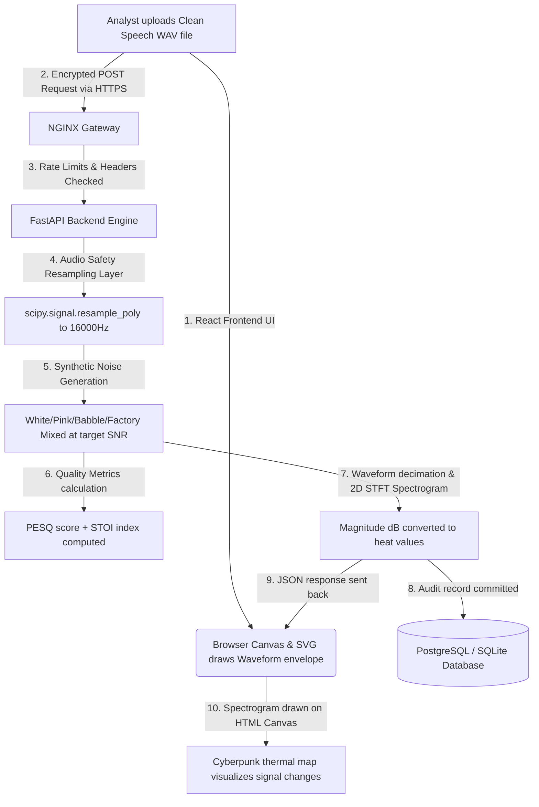

# DEAL Audio Quality Assessment Dashboard: Complete Project & Technical Guide

Welcome! This guide provides a comprehensive, bottom-up, layman-friendly explanation of the **DEAL Audio Quality Assessment Dashboard**. 

If you are new to web development, audio signal processing, or containerized deployments, do not worry—every concept, term, and library is explained here from absolute first principles.

---

## 1. What is this Project?

The **DEAL Audio Quality Assessment Dashboard** is a highly secure, offline-ready, and high-performance software application. It was engineered specifically for the air-gapped, high-security operating environments of **DEAL (Defense Electronics Applications Laboratory)**, a premier laboratory under **DRDO (Defence Research and Development Organisation)**.

### What is its purpose?
In military communications (such as radio broadcasts, satellite signals, or battlefield walkie-talkies), speech signals often experience heavy atmospheric noise, hardware distortion, or intentional jamming (interference). 

Scientists and engineers at DEAL need a tool to:
1. **Upload** a clean recording of human speech (a `.wav` file).
2. **Inject (Mix) synthetic noise** (like factory clatter, military babble, pink static, or white noise) into that speech at precise volume levels (measured in decibels, or **SNR**).
3. **Calculate quality metrics** (known as **PESQ** and **STOI**) to scientifically measure how distorted the speech became, and whether a human listener could still understand it.
4. **Visualize the result** immediately with gorgeous interactive charts, waveform comparison bars, and time-frequency heatmaps (spectrograms).

---

## 2. What has Been Done (Built So Far)

The project is already a fully functioning, enterprise-grade application. It is split into four distinct layers that communicate seamlessly:

1. **A Front-End Interface (The Dashboard UI)**: 
   * A premium, dark-mode, glass-like digital terminal. 
   * It features a file uploader supporting drag-and-drop, sliders to adjust noise volumes, dual-signal waveform visualizers using standard browser vectors (SVGs), and a dynamic, high-fidelity canvas that plots spectrogram thermal heatmaps.
2. **A Back-End Processing Engine**:
   * A high-speed, asynchronous Python server that handles the heavy mathematical lifting. 
   * It performs high-performance audio decimation (resampling), noise synthesis, signal-to-noise mixing, Short-Time Fourier Transforms (STFT), and quality index algorithms.
3. **A Relational Database**:
   * To keep an immutable (unchangeable) audit history of every analysis run and support access credentials.
4. **An NGINX Security Gateway**:
   * A frontline secure web server that handles secure SSL connections (HTTPS), blocks malicious traffic, and hides the internal servers behind a single point of entry.
5. **Dynamic Dual-Mode Operations**:
   * **Developer Mode**: Runs instantly on standard PCs without any virtualization software, storing data locally inside a portable file-based database (`SQLite`).
   * **Production Mode**: Packs the entire system into fully insulated virtual boxes (**Docker Containers**) connected by a secure internal network.

---

## 3. The Tech Stack: What was Used and Why?

The table below outlines the core technologies powering the dashboard and the engineering decisions behind selecting them:

| Technology | What is it? (Layman Term) | Why was it chosen for DEAL? |
| :--- | :--- | :--- |
| **Vite + React** | **The Frontend UI Engine** React builds the dynamic, modular visual blocks. Vite acts as a ultra-fast local bundler that compiles files instantly. | **Offline Responsiveness**: Run 100% locally in the browser with no internet required. React allows rapid interactive redraws of audio charts, sliders, and canvases without lagging. |
| **FastAPI** | **The Backend Python Server** An modern, asynchronous framework for building high-speed internet interfaces (APIs) using Python. | **Speed & Parallel Processing**: Audio manipulation is slow and resource-heavy. FastAPI runs operations *asynchronously* (in parallel) so many audio files can be calculated concurrently without freezing the system. |
| **PostgreSQL** | **The Relational Database** A rugged, industrial-grade data warehouse for saving users and runs. | **Audit Trails & Security**: PostgreSQL provides bank-level transactions, role segregation, and immutable logs to satisfy DRDO’s high-security compliance guidelines. |
| **SQLite (AioSQLite)** | **The Portable Database** A lightweight, serverless database that stores all data inside a single `.db` file on your hard drive. | **Zero-Configuration Developer Setup**: Allows a developer to run the backend instantly without setting up or installing a heavy database engine like PostgreSQL. |
| **NGINX** | **The Secure Reverse Proxy** A high-speed traffic controller that stands at the very front of the application. | **Hardened Defense & HTTPS**: Enforces absolute security, prevents DDoS/overload via strict rate limiting (5 requests/second), blocks coordinate sniffers, and handles TLS encryption keys. |
| **Docker & Compose** | **Containerization Platform** Virtualization tools that bundle an app and its exact operating system settings into standard "containers" (boxes). | **Air-Gapped Consistency**: In defense systems, code is written on normal PCs but deployed on isolated, internet-free hardware. Docker guarantees the app works *exactly the same* anywhere, with zero dependency issues. |

---

## 4. How Everything Works: The Step-by-Step Data Journey

To understand how the app works, let's trace the journey of an audio file through the system:

1. **Upload**: The Analyst signs in and drags a `speech.wav` file into the React UI config panel.
2. **Gateway Defense**: The file travels over an HTTPS connection. NGINX intercepts it, checks that the file size doesn't exceed 25MB, verifies the analyst has active tokens, and routes it to the FastAPI backend.
3. **Audio Extraction**: The FastAPI engine opens the WAV file into numerical lists (vectors of sound pressure) using the Python `soundfile` library.
4. **Safety Resampling**: Standard audio algorithms (like PESQ and STOI) are notoriously fragile and will crash, freeze, or give incorrect results if run on weird sampling rates (like 44,100 Hz or 48,000 Hz). The system routes the audio through a **poly-phase resampling filter** (`scipy.signal.resample_poly`), safely converting it to the wide-band standard of **16,000 Hz** to guarantee calculations never crash.
5. **Noise Synthesis & Mixing**: Based on the slider value (e.g., `-5 dB`), the backend synthesizes noise and scales it mathematically using Root-Mean-Square (RMS) formulas. It overlays the noise directly onto the clean speech, creating a `noisy_signal`.
6. **KPI Calculation**: It runs mathematical models for **PESQ** (Perceptual Evaluation of Speech Quality) and **STOI** (Short-Time Objective Intelligibility) to score the degraded signal.
7. **Spectrogram Generation**: To show the speech visually, the backend runs a **Short-Time Fourier Transform (STFT)**. This slices the signal into tiny time windows and runs math to calculate which frequencies (bass, mid, treble) are loudest in each window. It shrinks this matrix into a highly compressed, light JSON package of 80 columns by 40 rows.
8. **Logging & Saving**: The details of the run (Analyst, file name, target SNR, actual SNR, PESQ, and STOI scores) are saved securely in the PostgreSQL (or SQLite) database.
9. **Visual Rendering**: The frontend receives the visual package. It uses vector mathematics to draw the clean (blue) and noisy (cyan) waves directly as scalable SVG shapes. It then maps the 2D spectrogram database values to a gorgeous neon-flame color scale (Deep Purple $\rightarrow$ Hot Pink $\rightarrow$ Neon Orange $\rightarrow$ Cyber Yellow) and paints them pixel-by-pixel onto a browser `<canvas>` element.

---

## 5. Technical Terms Defined in Layman's Terms

To help you talk like a seasoned signal processing engineer or software architect, here is an indexed glossary of every technical term in this project:

### A. Audio & Signal Processing Terms

* **WAV (.wav)**: A raw, uncompressed audio file format. Unlike MP3s, which discard details to save space, WAV files preserve every tiny fluctuation in sound waves, making them crucial for precise scientific research.
* **Sampling Rate (Hz - Hertz)**: Sound is a continuous wave, but computers can only store discrete numbers. The sampling rate is how many times per second the computer takes a snapshot of the sound wave. For example, `16000 Hz` means 16,000 snapshots per second.
* **Signal-to-Noise Ratio (SNR)**: A measurement that compares the level of a desired signal (like a person speaking) to the level of background noise (static/interference). 
  * A **positive SNR** (e.g., +10 dB) means the speech is much louder than the noise.
  * A **negative SNR** (e.g., -10 dB) means the noise has overwhelmed the speech.
* **Decibel (dB)**: A logarithmic unit used to express the ratio of two values (in this case, speech volume vs. noise volume). Because it is logarithmic, a drop of 6 dB represents a halving of the sound pressure level!
* **RMS (Root Mean Square)**: A statistical measure of the average power or volume of an audio signal over time. Instead of looking at individual peak spikes, RMS measures the overall "weight" of the sound wave.
* **Spectrogram**: A visual chart that shows how the frequencies of an audio signal change over time. The horizontal axis represents time, the vertical axis represents frequency (low bass to high treble), and the color representing brightness represents loudness (intensity).
* **STFT (Short-Time Fourier Transform)**: A mathematical algorithm used to convert a normal audio wave (which is just amplitude over time) into a frequency spectrogram (which shows pitch vs. time). It acts like a "prism," separating combined sounds into their individual constituent frequencies.
* **Poly-phase Filtering (`resample_poly`)**: An advanced, computationally efficient method for changing an audio file's sampling rate. It uses clever mathematics to interpolate (add) or decimate (remove) samples without introducing artificial echoes or ringing sounds (known as aliasing).

### B. Speech Quality Standard Metrics

* **PESQ (Perceptual Evaluation of Speech Quality)**: A standardized objective metric that mimics how a human ear perceives audio. It compares the clean speech and the degraded speech and outputs a **Mean Opinion Score (MOS)** between **1.0 (unintelligible garbage)** and **4.5 (flawless face-to-face clarity)**.
* **STOI (Short-Time Objective Intelligibility)**: A standardized index that specifically measures **how easy it is to understand the spoken words**. It outputs a percentage-like score between **0.0 (cannot recognize a single word)** and **1.0 (100% word recognition)**.

### C. Software & Web Architecture Terms

* **API (Application Programming Interface)**: A bridge that allows two software programs to speak to each other. In our app, the Frontend React UI uses the API to ask the FastAPI Backend to process audio files and return numbers.
* **REST API**: A standard, structured style of building APIs using standard web request words like **POST** (create/upload), **GET** (read/view), **PUT** (update), and **DELETE** (erase).
* **Asynchronous Programming (`async` / `await`)**: A technique where a server doesn't get blocked waiting for a slow task (like a database search or audio resampling) to complete. Instead of freezing, it sets the slow task in the background and processes other requests in the meantime, making the application lightning-fast.
* **CORS (Cross-Origin Resource Sharing)**: A security system built into web browsers that stops a website on one domain from talking to a database on a different domain. In our production container setup, NGINX bypasses this inside the local network safely.
* **Reverse Proxy**: A middleman server that sits between the public internet and private backend servers. It accepts incoming requests, inspects them for security threats, and forwards them to the correct internal container.
* **SSL/TLS & HTTPS**: Cryptographic communication protocols that encrypt all data passing between the user's browser and the server, preventing eavesdropping, tampering, or coordinate sniffing.
* **JWT (JSON Web Token)**: A secure, digital ID card issued by the server when a user logs in. The browser stores this token (in memory or storage) and presents it automatically with every action, proving the user's identity without requiring them to re-type their password.
* **Access vs. Refresh Tokens**: 
  * **Access Token**: A temporary pass (expires in 15 minutes) used to request calculation pages.
  * **Refresh Token**: A long-term key (lasts 7 days) stored securely to automatically request a new access token when the 15-minute key expires, allowing seamless use without annoying login prompts.
* **ORM (Object-Relational Mapping)**: A tool (we use `SQLAlchemy`) that lets developers interact with databases using clean Python code instead of raw database query code (SQL). It translates a Python class (like `class User`) into database rows automatically.

---

## 6. Installed Code Libraries & Their Roles

Here are the key third-party libraries installed in the `/backend/requirements.txt` file and what they do in simple terms:

1. **`fastapi`**: The foundation for our fast, modern web API backend server.
2. **`uvicorn`**: A lightweight web server that runs the Python FastAPI code and listens for incoming web requests on port `8000`.
3. **`sqlalchemy` & `asyncpg`**: The database connection toolkit. `sqlalchemy` acts as our ORM translation layer, and `asyncpg` is the high-performance async driver for communicating with PostgreSQL.
4. **`aiosqlite`**: The lightweight SQLite async driver used for local development, allowing instant SQL operations without installing an external database service.
5. **`librosa`**: An industry-standard scientific Python package for music and audio analysis. We use it to perform the Short-Time Fourier Transform (STFT) and map physical sound amplitudes into visual decibel heatmaps.
6. **`soundfile`**: A specialized, reliable library used for opening, reading, and writing audio files (like WAVs) into Python list structures.
7. **`numpy`**: The ultimate math wizard library for Python. It allows instant vector mathematics, statistical calculations, and array processing on millions of audio samples at once.
8. **`scipy`**: A scientific library containing advanced mathematical tools. We use it for dynamic poly-phase resampling (`scipy.signal.resample_poly`) to stabilize our audio metrics.
9. **`python-jose`**: The cryptographic security library that generates, signs, and decodes secure JSON Web Tokens (JWT) for authentication.
10. **`passlib` & `bcrypt`**: Standard security libraries that handle password hashing. Instead of saving plain passwords (like `deal@123`), the backend scrambles them using standard cryptographic hash algorithms (Bcrypt) before committing them to database tables.

---

## 7. Immediate Directory Testing

The application seeds default security access credentials automatically on initial database startup:

| Role Level | Username | Password | What Can They Do? |
| :--- | :--- | :--- | :--- |
| **Administrator** | `pragya` | `deal@123` | Can view and add new user accounts, rotate security credentials, assign supervisor/analyst roles, and delete accounts. |
| **Supervisor** | `supervisor` | `supervisor123` | Can access the history log, filter historical quality runs, view aggregate stats, and export logs to secure CSV spreadsheets. |
| **Analyst** | `analyst` | `analyst123` | Can upload clean signals, select noise interferences, adjust decibel sliders, and run the calculation engine. |

You are now fully equipped to understand, build, and run the **DEAL Audio Quality Assessment Dashboard** like a professional! Let your partner know if you would like to run tests, write custom algorithms, or iterate on the premium UI designs.
